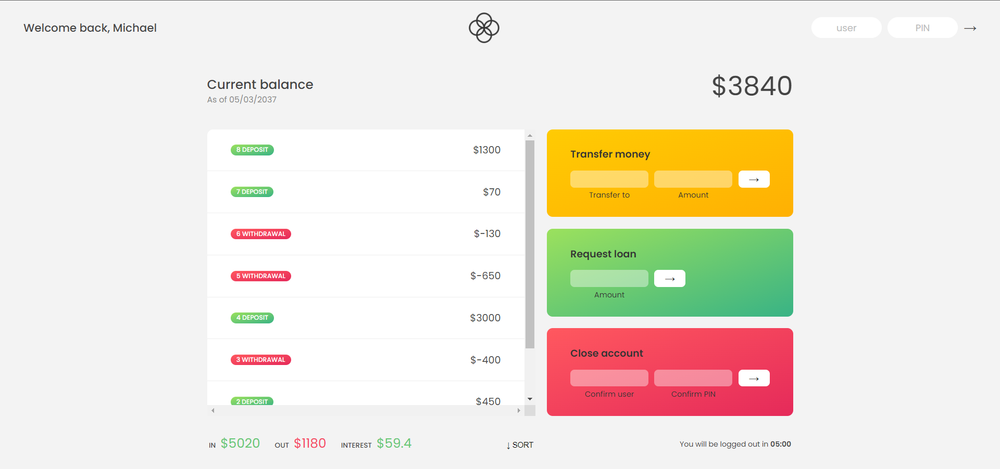

# Bank-Simulator-App
This is a small bank simulation app I created to practice learning JavaScript  

Try it out! https://mictran8500.github.io/Bank-Simulator-App  
Sample users:  
  username: mt  
  password: 1111  
  
  username: rl  
  password: 2222  
  
  username: tn  
  password: 3333  

Features include:  
- Logging in using a generated username and password
- Transfering money
- Requesting a loan  
- Deleting your account  
- Sorting the transactions  

This is a project from Jonas Schemdtmann's "The Complete JavaScript Course 2022: From Zero to Expert!" course.
